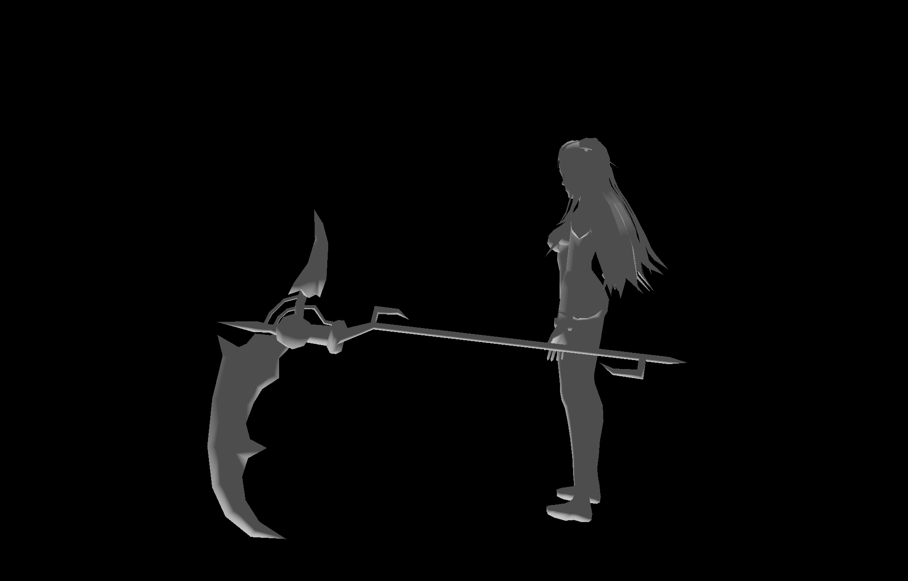
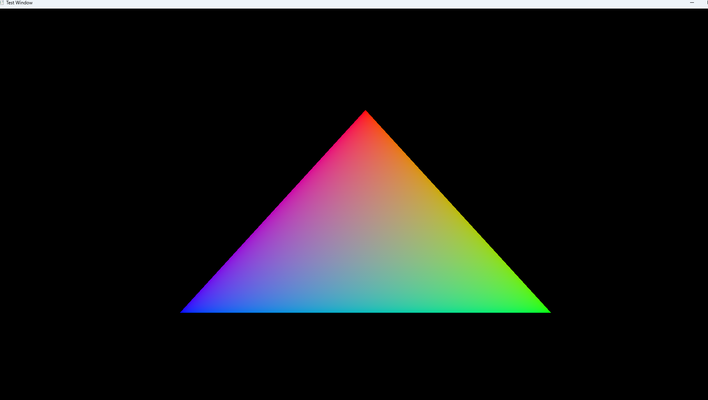

# Vulkan Rendering Engine  
*A minimal, modern C++23 graphics engine built from scratch using Vulkan 1.4 and a custom Win32 window system.*  


-lightgrey.svg)


Update 3: Texture System


Added texture loading to the engine:
- Can load images (JPG, PNG, etc.) from files
- Textures cache automatically so they load once
- Falls back to white texture if file not found
- Models now display textures with UV mapping

Classes added:
- VulkanImage
- VulkanImageView  
- Texture
- TextureManager

Shaders updated to sample textures with lighting

---
# Update 2.1


Added lighting with directional lighting.

---
# Update 2


## New Features
- **Input System** — Keyboard and mouse handling with per-frame edge detection
- **Camera System** — First-person camera with full 3D movement
- **OBJ Model Loader** — Wavefront .OBJ parser supporting:
  - Vertex positions, normals, and texture coordinates
  - Face triangulation for n-gons (fan method)
  - Vertex de-duplication for optimized indices

## Controls
- **W / A / S / D** — Move forward / left / backward / right  
- **Mouse** — Look around (first-person)  
- **Space** — Move up  
- **Ctrl** — Move down

## Code Quality
- Refactored `main.cc` for readability and maintainability
- Split rendering into focused functions
- Clarified initialization sequence

## Bug Fixes
- Fixed GLM alignment/defines causing geometry corruption
- Corrected descriptor set binding for the model pipeline
- Fixed shader compilation and asset loading paths

## Loading Your Own OBJ
Place your model in `App/Models/`, then change the loaded filename in code
from the sample `"Residential Buildings 010.obj"` to your file name.
Make sure your post-build step copies `App/Models/` into the executable’s
output directory so relative paths resolve correctly.
 

---
My journey building a graphics renderer from absolute scratch. No game engines, no shortcuts, just me, the Vulkan specification, and a lot of determination to understand how modern games actually work under the hood.




## Why I Built This

I've always been fascinated by how games like League of Legends manage to render hundreds of abilities and effects at 144+ FPS during intense teamfights. I wanted to understand the low-level systems that make that possible, so I decided to build a Vulkan renderer from the ground up with zero prior graphics programming experience.

The moment that triangle finally appeared on screen after weeks of learning, debugging, and rebuilding was genuinely one of the best feelings I've had in programming. Every component in this project was built by hand to really understand what's happening at each layer of the graphics pipeline.

## What's Actually Working Right Now

**Core Vulkan Systems I've Implemented:**
- Vulkan instance initialization with validation layers for debugging
- Physical and logical device management with proper queue family selection
- Swapchain implementation with double buffering for smooth presentation
- Render pass architecture defining how rendering happens
- Complete graphics pipeline with GLSL shader compilation to SPIR-V
- Command buffer system for recording and submitting GPU commands
- Frame synchronization using semaphores and fences (CPU-GPU coordination)
- GPU memory management using Vulkan Memory Allocator (VMA)

**Application Framework:**
- Win32 window integration for platform-specific windowing
- Base application class with Update() and Render() lifecycle hooks
- Event polling to keep windows responsive

**Things I'm Proud Of:**
- Comprehensive error logging system with unique error codes per component (made debugging way less painful)
- Professional RAII patterns so resources clean themselves up automatically
- Clean C++23 architecture with smart pointers throughout
- Modular design where each Vulkan component is completely isolated

## Current Status

Right now it's rendering a hardware-accelerated triangle at 60 FPS with proper frame synchronization. Not much visually, but getting here required implementing every single piece of the Vulkan rendering pipeline.

**What's Next:** Vertex buffers with real geometry data, texture loading and sampling, 3D camera transformations, and basic lighting systems.

## Tech Stack

| Component | Description |
|------------|--------------|
| **Language** | C++23 |
| **Graphics API** | Vulkan 1.4 |
| **Build System** | CMake |
| **Platform** | Windows (Win32 API) |
| **Memory Manager** | Vulkan Memory Allocator (VMA) |
| **Shaders** | GLSL → SPIR-V compilation |

## Building From Source

**You'll Need:**
- Vulkan SDK 1.4 or newer
- CMake 3.21+
- C++23 compatible compiler (MSVC 2022, GCC 13+, or Clang 16+)
- vcpkg for dependency management

**Build Steps:**
```bash
# Install dependencies via vcpkg
vcpkg install vulkan vulkan-memory-allocator glm

# Generate build files
cmake -B build -S . -DCMAKE_TOOLCHAIN_FILE=[path-to-vcpkg]/scripts/buildsystems/vcpkg.cmake

# Compile
cmake --build build --config Release

# Run
./build/Release/OwnGameEngine.exe
```

## What I Actually Learned

### Understanding the Graphics Pipeline
I didn't just implement these systems, I really had to understand WHY each piece exists. Like why render passes are structured the way they are (GPU optimization), or how semaphores prevent race conditions between the CPU and GPU, or why you need multiple frames in flight for smooth performance.

### Low-Level Systems Programming
Managing complex resource lifetimes where everything depends on everything else taught me a lot about RAII patterns and smart pointers. Debugging GPU errors with validation layers was its own learning curve. Building an error code system that actually helps you find problems quickly was surprisingly important.

### Performance and Architecture
Learning about the trade-offs between frames-in-flight and input latency, understanding GPU memory allocation strategies, figuring out efficient command buffer patterns, these aren't things you think about with high-level engines, but they matter a lot for performance-critical applications.

## Project Structure

```text
Core/
├── Application/            # Application framework and lifecycle
├── Renderer/               # All Vulkan rendering components
│   ├── VulkanCommandBuffer/
│   ├── VulkanDevice/
│   ├── VulkanFrameBuffer/
│   ├── VulkanGraphicsPipeline/
│   ├── VulkanInstance/
│   ├── VulkanMemoryAllocator/
│   ├── VulkanRenderer/
│   ├── VulkanRenderPass/
│   ├── VulkanSurface/
│   ├── VulkanSwapchain/
│   ├── VulkanSynchronization/
│   └── RendererInterface.h
└── Window/                 # Platform windowing (Win32)

Shaders/                    # GLSL shaders (auto-compiled to SPIR-V)
```

Each component is completely self-contained. If something breaks, you know exactly where to look because everything is isolated and has its own error code range.

## What I'm Building Next

**Short Term (Next Few Weeks):**
- Vertex buffer support so I can actually load geometry instead of hardcoding it
- Texture loading and sampling to put images on surfaces
- 3D camera system with model-view-projection transformations
- Basic Phong lighting to make things look three-dimensional

**Long Term Vision:**
- Full model loading (OBJ/glTF formats)
- Advanced rendering techniques (shadow mapping, post-processing effects)
- ImGui integration for runtime debugging
- Multi-threaded command buffer recording for better CPU utilization

The goal is to eventually build something small but complete, understanding every line of code from window creation to pixels on screen.

## How I Approached This

I built this with the same practices I'd use in production code:
- Every single Vulkan API call is validated with proper error checking
- Systematic error code ranges (0x00003000–0x0000A000) so you can immediately identify which component failed
- Clean separation of concerns, each system is independently understandable
- Modern C++ throughout (RAII, smart pointers, zero raw memory management)

The debugging experience was important to me because I know how frustrating it is when something breaks and you have no idea where. Every error message tells you exactly what failed and where.

## Learning Resources

Built by learning from the Vulkan specification, [vulkan-tutorial.com](https://vulkan-tutorial.com), and a lot of trial and error. The validation layers were absolutely critical for learning, they tell you exactly what you're doing wrong.

**Status:** Actively developing  
**License:** MIT
